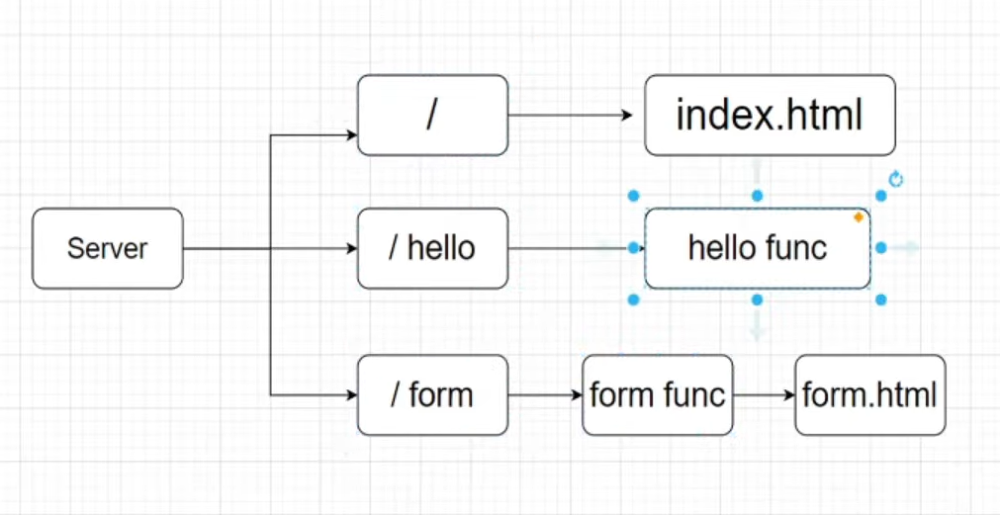

# Go Server Project

## Overview

This project is a simple HTTP server written in Go. It demonstrates basic web server functionality, including serving static files, handling GET and POST requests, and providing a health check endpoint.

## Features

- **Static File Serving:** Serves files from the `./static` directory at the root path (`/`).
- **Hello Endpoint:** Responds to `GET /hello` with a plain text greeting.
- **Form Endpoint:** Accepts `POST /form` requests, parses form data, and responds with a personalized message.
- **Health Check:** Provides a health check at `GET /health` that returns `OK`.

## Design

The server uses Go's standard `net/http` package. Each endpoint is handled by a dedicated function, ensuring clear separation of concerns. Static files are served using Go's built-in `http.FileServer`. The server listens on port `8080`.

For a bird's-eye view of the project architecture, refer to the following diagram:



## Getting Started

1. **Build and Run:**
   ```sh
   go run main.go